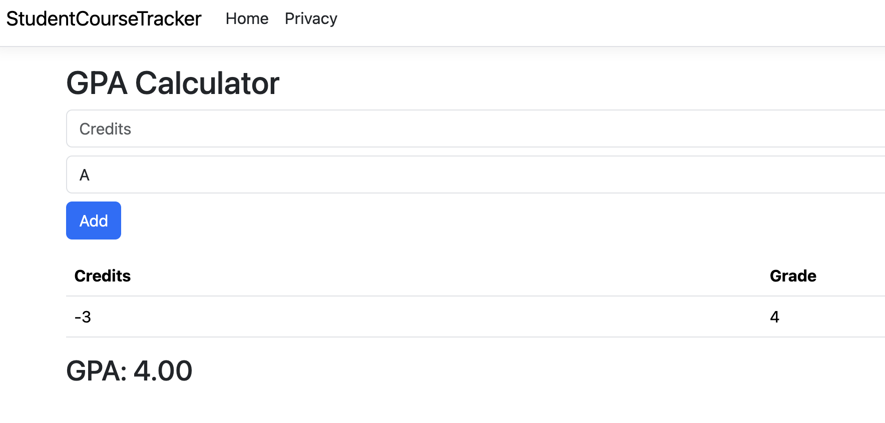

# Bug Report

**Bug ID:** BUG-001  
**Title:** GPA calculator accepts negative credit values  
**Feature:** GPA Calculator  
**Severity:** High  
**Priority:** High  

## Steps to Reproduce
1. Open GPA Calculator page
2. Enter credits: -3
3. Select grade: A
4. Click Add

## Expected Result
Application should reject negative credits and show validation error.

## Actual Result
Course is added and GPA calculation becomes incorrect.

## Environment
- Browser: Chrome
- OS: macOS

## Screenshot
