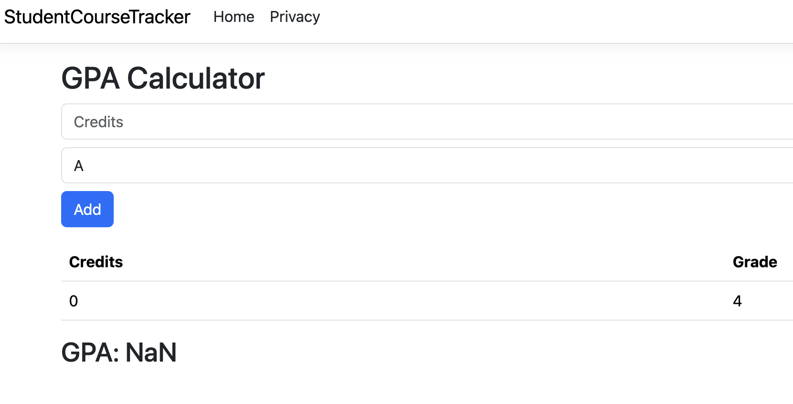

# Bug Report

**Bug ID:** BUG-002  
**Title:** GPA calculator accepts zero-credit values and displays NaN GPA  
**Feature:** GPA Calculator  
**Severity:** High  
**Priority:** Medium  

## Description
The GPA calculator allows users to add courses with 0 credits. This results in a division-by-zero scenario, causing the GPA to display as "NaN" (not a number), which could be confusing and invalid from a user perspective.

## Steps to Reproduce
1. Open the GPA Calculator page  
2. Enter credits: 0  
3. Select grade: A  
4. Click Add  

## Expected Result
The application should:
- Reject zero-credit inputs  
- Display a validation message (e.g., "Credits must be greater than 0")  
- Prevent the course from being added  

## Actual Result
- The course is added with 0 credits  
- GPA is calculated as "NaN" due to division by zero  

## Impact
- Breaks GPA calculation logic  
- Displays invalid output to users  
- Reduces reliability and usability of the feature  

## Environment
- Browser: Chrome  
- OS: macOS  

## Screenshot
