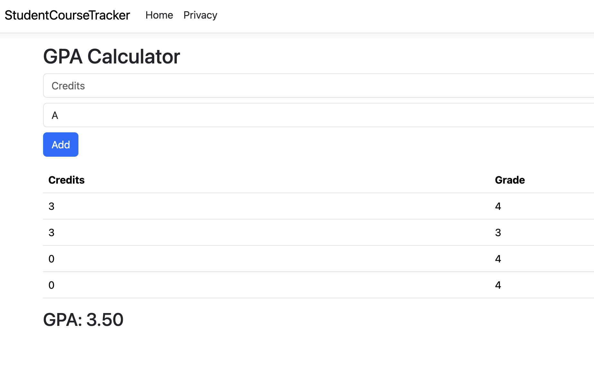

# Bug Report

**Bug ID:** BUG-003  
**Title:** GPA calculator allows submission with empty credit input  
**Feature:** GPA Calculator  
**Severity:** Medium  
**Priority:** Medium  

## Description
The GPA calculator allows users to submit the form without entering a credit value, which can result in invalid or unintended behavior.

## Steps to Reproduce
1. Open GPA Calculator page  
2. Leave credits field empty  
3. Select grade: A  
4. Click Add  

## Expected Result
The application should:
- Require a credit value  
- Display a validation message  
- Prevent submission  

## Actual Result
The course is added without a valid credit value.

## Impact
- Allows invalid data entry  
- May lead to incorrect GPA calculations  
- Reduces reliability of the application  

## Environment
- Browser: Chrome  
- OS: macOS  

## Screenshot
