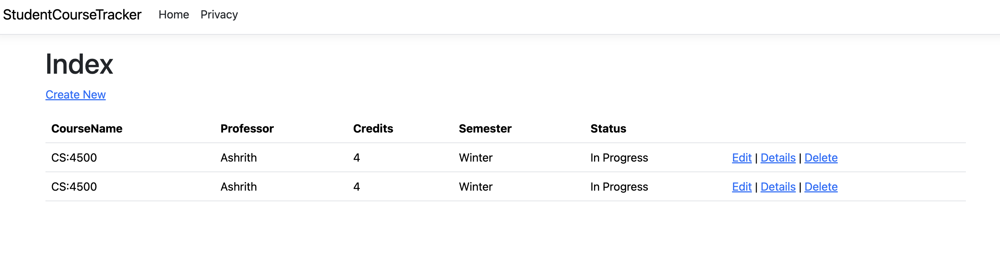

# Bug Report

**Bug ID:** BUG-005  
**Title:** Duplicate course entries are allowed  
**Feature:** Course Management (/Courses)  
**Severity:** Medium  
**Priority:** Medium  

## Description
The application allows users to create multiple courses with identical names and attributes. This can lead to duplicate records and confusion when managing course data.

## Steps to Reproduce
1. Navigate to Courses page  
2. Add a course with valid data (e.g., CS101, 3 credits)  
3. Add the same course again with identical values  

## Expected Result
The application should:
- Prevent duplicate course entries  
- OR notify the user that the course already exists  

## Actual Result
The application allows duplicate courses to be created and displayed  

## Impact
- Creates redundant data  
- Confuses users when viewing course list  
- Can affect GPA calculations if duplicates are unintentionally included  

## Environment
- Browser: Chrome  
- OS: macOS  

## Screenshot
